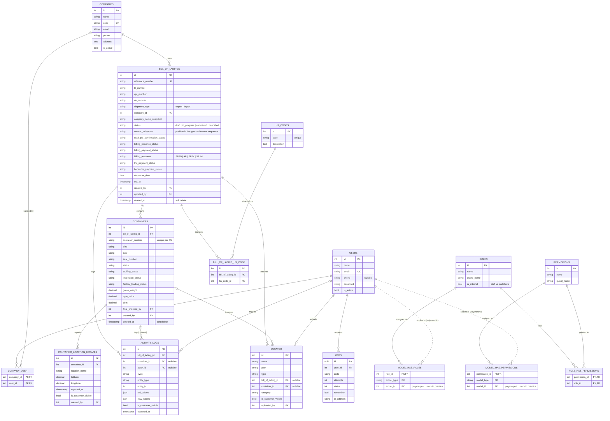

<!--
File: docs/ERD.md
Responsibility: Documents the full database schema as an entity-relationship diagram.
What it does:
- Renders a Mermaid erDiagram covering all domain tables and spatie permission tables.
- Notes below list intentionally excluded Laravel-internal tables and conventions.
How to use: View on GitHub or any Mermaid-compatible renderer.
How to extend: Update the erDiagram block whenever a migration adds or changes a table.
-->

# Entity Relationship Diagram

## Notes

- **Excluded (Laravel internals):** `cache`, `jobs`, `sessions`, `password_reset_tokens` — framework plumbing, not domain data.
- **`CURATOR` is the attachments table.** `App\Models\Attachment` extends Curator's media model; the shipment columns (`bill_of_lading_id`, `container_id`, `category`, `is_customer_visible`, `uploaded_by`) were added to it and the old `attachments` table was dropped.
- **Audit FKs:** every `created_by` / `updated_by` / `final_checked_by` / `actor_id` / `uploaded_by` column references `users.id`. Only `ACTIVITY_LOGS` and `CURATOR` draw their user edges; the rest are omitted to keep the diagram readable.
- **Polymorphic pivots:** `model_has_roles` / `model_has_permissions` have no real FK to `users` (`model_type` + `model_id`); dotted lines mark that. In practice only `users` rows appear there.
- **Cardinality:** `|o` on the left means the child's FK is nullable (e.g. an `activity_log` may have no `container_id` when the entry is B/L-scoped).
- **Composite unique keys:** `company_user (company_id, user_id)`, `bill_of_lading_hs_code (bl_id, hs_code_id)`, `containers (bl_id, container_number)`.
