# Entity Relationship Diagram

<!--
File: docs/ERD.md
Responsibility: Documents the full database schema as an entity-relationship diagram.
What it does:
- Renders a Mermaid erDiagram covering all domain tables and spatie permission tables.
- Notes below list intentionally excluded Laravel-internal tables and conventions.
How to use: View on GitHub or any Mermaid-compatible renderer.
How to extend: Update the erDiagram block whenever a migration adds or changes a table.
-->

```mermaid
erDiagram
    USERS ||--o{ OTPS : requests
    USERS ||--o{ COMPANY_USER : handles
    COMPANIES ||--o{ COMPANY_USER : "handled by"
    ROLES ||--o{ MODEL_HAS_ROLES : "assigned via"
    USERS ||..o{ MODEL_HAS_ROLES : "applies to (polymorphic)"
    ROLES ||--o{ ROLE_HAS_PERMISSIONS : has
    PERMISSIONS ||--o{ ROLE_HAS_PERMISSIONS : "granted to"
    PERMISSIONS ||--o{ MODEL_HAS_PERMISSIONS : "assigned via"
    USERS ||..o{ MODEL_HAS_PERMISSIONS : "applies to (polymorphic)"

    COMPANIES ||--o{ EXPORT_SHIPMENTS : owns
    COMPANIES ||--o{ IMPORT_SHIPMENTS : owns
    EXPORT_SHIPMENTS ||--o{ EXPORT_CONTAINERS : contains
    IMPORT_SHIPMENTS ||--o{ IMPORT_CONTAINERS : contains
    IMPORT_SHIPMENTS ||--o{ IMPORT_SHIPMENT_HS_CODE : declares
    IMPORT_CONTAINERS ||--o{ IMPORT_CONTAINER_HS_CODE : declares
    HS_CODES ||--o{ IMPORT_SHIPMENT_HS_CODE : "attached via"
    HS_CODES ||--o{ IMPORT_CONTAINER_HS_CODE : "attached via"

    EXPORT_SHIPMENTS |o--o{ ACTIVITY_LOGS : logs
    IMPORT_SHIPMENTS |o--o{ ACTIVITY_LOGS : logs
    EXPORT_CONTAINERS |o--o{ ACTIVITY_LOGS : "logs (optional)"
    IMPORT_CONTAINERS |o--o{ ACTIVITY_LOGS : "logs (optional)"
    USERS |o--o{ ACTIVITY_LOGS : triggers

    EXPORT_SHIPMENTS |o--o{ CURATOR : attaches
    IMPORT_SHIPMENTS |o--o{ CURATOR : attaches
    EXPORT_CONTAINERS |o--o{ CURATOR : attaches
    IMPORT_CONTAINERS |o--o{ CURATOR : attaches
    USERS |o--o{ CURATOR : uploads

    USERS ||..o{ NOTES : "notes (polymorphic)"
    COMPANIES ||..o{ NOTES : "notes (polymorphic)"
    EXPORT_SHIPMENTS ||..o{ NOTES : "notes (polymorphic)"
    IMPORT_SHIPMENTS ||..o{ NOTES : "notes (polymorphic)"
    EXPORT_CONTAINERS ||..o{ NOTES : "notes (polymorphic)"
    IMPORT_CONTAINERS ||..o{ NOTES : "notes (polymorphic)"

    USERS {
        int id PK
        string name
        string email UK
        string phone "nullable"
        string password
        bool is_active
    }

    OTPS {
        uuid id PK
        int user_id FK
        string code
        int attempts
        int status
        bool remember
        string ip_address
    }

    COMPANIES {
        int id PK
        string name
        string code UK
        string email
        string phone
        text address
        bool is_active
    }

    COMPANY_USER {
        int company_id PK, FK
        int user_id PK, FK
    }

    ROLES {
        int id PK
        string name
        string guard_name
        bool is_internal "staff vs portal role"
    }

    PERMISSIONS {
        int id PK
        string name
        string guard_name
    }

    MODEL_HAS_ROLES {
        int role_id PK, FK
        string model_type PK
        int model_id PK "polymorphic, users in practice"
    }

    MODEL_HAS_PERMISSIONS {
        int permission_id PK, FK
        string model_type PK
        int model_id PK "polymorphic, users in practice"
    }

    ROLE_HAS_PERMISSIONS {
        int permission_id PK, FK
        int role_id PK, FK
    }

    EXPORT_SHIPMENTS {
        int id PK
        string bl_number
        string shipment_mode "FCL | LCL | Air"
        int company_id FK
        string company_name_snapshot
        date document_received_date
        int document_received_by FK
        string aju_number
        string do_number
        string shipping_line
        string vessel_name
        string voyage_number
        string port_of_loading
        string port_of_discharge
        timestamp depot_closing_at
        timestamp cy_closing_at
        string pickup_depot_name
        date stuffing_date
        text stuffing_destination
        date departure_date
        timestamp eta_at
        string status "draft | in_progress | completed | cancelled"
        string current_milestone "ExportMilestone position"
        timestamp completed_at
        timestamp deleted_at "soft delete"
    }

    IMPORT_SHIPMENTS {
        int id PK
        string bl_number
        string shipment_mode
        int company_id FK
        string company_name_snapshot
        date document_received_date
        int document_received_by FK
        string shipping_line
        string vessel_name
        bool confirmation_checklist
        int confirmed_by FK
        string aju_number
        string voyage_number
        string billing_issuance_status
        string port_of_loading
        date departure_date
        string port_of_discharge
        timestamp eta_at
        string billing_response "SPPB | AP | SPJK | SPJM"
        text goods_description "unlocks at Response billing"
        string packages "unlocks at Response billing"
        string terminal_name
        date loading_date
        text loading_destination
        string status "draft | in_progress | completed | cancelled"
        string current_milestone "ImportMilestone position"
        timestamp completed_at
        timestamp deleted_at "soft delete"
    }

    EXPORT_CONTAINERS {
        int id PK
        int export_shipment_id FK
        string container_number "unique per shipment"
        string size
        string seal_number
        string driver_name
        string license_number "vehicle / truck"
        string driver_license_number
        string tracking_position "latest position text"
        string tracking_position_url
        string stuffing_status
        string port_of_loading "defaults from the shipment, overridable"
        timestamp gate_in_cy_at
        decimal vgm_value "always kg"
        bool final_checked
        timestamp final_checked_at
        timestamp deleted_at "soft delete"
    }

    IMPORT_CONTAINERS {
        int id PK
        int import_shipment_id FK
        string container_number "unique per shipment"
        string size
        string seal_number
        text description_of_goods "seeded from the shipment, overridable"
        string packages "seeded from the shipment, overridable"
        string driver_name
        string license_number "No. License"
        timestamp gate_out_cy_at
        string tracking_position "driver position text"
        string tracking_position_url "validated URL"
        decimal gross_weight
        decimal cbm
        string factory_loading_status
        string return_depot_name
        timestamp empty_returned_at
        string status
        timestamp completed_at
        timestamp deleted_at "soft delete"
    }

    HS_CODES {
        int id PK
        string code "unique"
        text description
    }

    IMPORT_SHIPMENT_HS_CODE {
        int id PK
        int import_shipment_id FK
        int hs_code_id FK
    }

    IMPORT_CONTAINER_HS_CODE {
        int id PK
        int import_container_id FK
        int hs_code_id FK
    }

    ACTIVITY_LOGS {
        int id PK
        int export_shipment_id FK "nullable; exactly one shipment link is set"
        int import_shipment_id FK "nullable"
        int export_container_id FK "nullable"
        int import_container_id FK "nullable"
        int actor_id FK "nullable"
        string event
        string entity_type
        int entity_id
        json old_values
        json new_values
        text customer_summary
        timestamp occurred_at
    }

    CURATOR {
        int id PK
        string name
        string path
        string type
        int export_shipment_id FK "nullable"
        int import_shipment_id FK "nullable"
        int export_container_id FK "nullable"
        int import_container_id FK "nullable"
        string category
        bool is_customer_visible
        int uploaded_by FK
    }

    NOTES {
        int id PK
        string noteable_type "polymorphic"
        int noteable_id "polymorphic"
        text body
        int author_id FK "nullable"
    }
```

## Notes

- **Excluded (Laravel internals):** `cache`, `jobs`, `sessions`, `password_reset_tokens` — framework plumbing, not domain data.
- **Split by process:** Export and Import have their own shipment and container tables; there is no `shipment_type` column. Any row that links to a shipment carries `export_shipment_id` or `import_shipment_id` (exactly one), and any row that links to a container carries `export_container_id` or `import_container_id` matching the shipment's process.
- **`CURATOR` is the attachments table.** `App\Models\Attachment` extends Curator's media model; the shipment/container links, `category`, `is_customer_visible` and `uploaded_by` were added to it and the old `attachments` table was dropped.
- **Audit FKs:** every `actor_id` / `uploaded_by` / `author_id` column references `users.id`. Only `ACTIVITY_LOGS`, `CURATOR` and `NOTES` draw their user edges; the rest are omitted to keep the diagram readable.
- **Polymorphic pivots:** `model_has_roles` / `model_has_permissions` have no real FK to `users` (`model_type` + `model_id`); dotted lines mark that. In practice only `users` rows appear there. `NOTES` uses the same polymorphic pattern for its target.
- **Cardinality:** `|o` on the left means the child's FK is nullable (e.g. an `activity_log` may have no container link when the entry is shipment-scoped, or no shipment link when it is about a company or user).
- **Composite unique keys:** `company_user (company_id, user_id)`, `import_shipment_hs_code (import_shipment_id, hs_code_id)`, `import_container_hs_code (import_container_id, hs_code_id)`, `export_containers (export_shipment_id, container_number)`, `import_containers (import_shipment_id, container_number)`.
- **Import cargo fields:** the shipment's `goods_description`, `packages` and HS codes unlock at the Response billing step; each import container carries its own `description_of_goods`, `packages` and HS-code pivot rows, seeded from the shipment and overridable.
- **Soft deletes:** `EXPORT_SHIPMENTS`, `IMPORT_SHIPMENTS`, `EXPORT_CONTAINERS`, `IMPORT_CONTAINERS`, `USERS`, `COMPANIES` and `HS_CODES` carry a nullable `deleted_at`. Admin/super_admin may soft-delete and restore; only super_admin may permanently delete (`forceDelete`) or prune. A soft-deleted user cannot authenticate or reach the admin panel.
